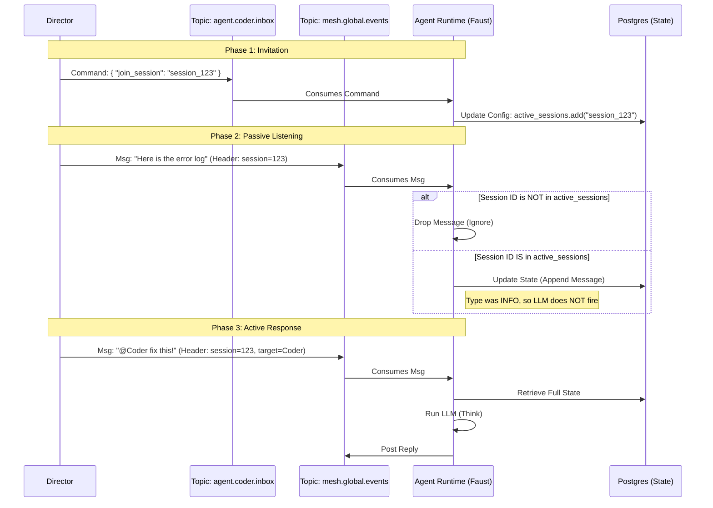
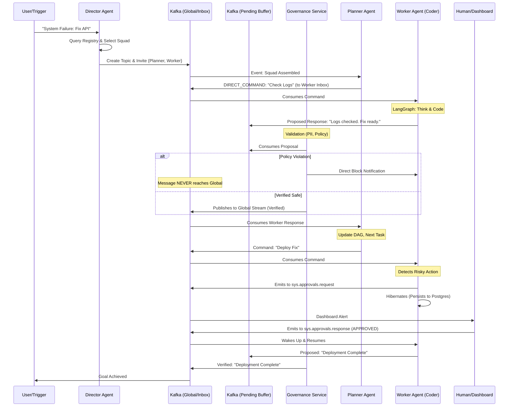

This comprehensive guide synthesizes the high-level "Squad" organizational paradigm (PDF 1) with the deep technical "Agentic Mesh" implementation (PDF 2). It unifies the business logic of decentralized teams with the engineering reality of Event-Driven Architecture (EDA).

---

# The Decentralized Agentic Mesh: 2025 Squad Architecture

## 1. Executive Summary
We are pivoting from linear, brittle "Pipeline" orchestrations to a **Decentralized Agentic Mesh**. In this architecture, the system does not merely route tasks; it assembles ad-hoc "Squads" of specialized agents into persistent, event-driven environments.

*   **The Metaphor:** A high-functioning engineering team using a group chat (Slack/Teams).
*   **The Technology:** An Event-Driven Architecture (EDA) using **Apache Kafka** as a distributed commit log, **LangGraph** for agent cognition, and **Faust** for high-performance stream processing.
*   **The Key Shift:** From **Orchestration** (Central brain commanding "Do X") to **Choreography** (Agents observing a shared stream and acting based on their specific tools and triggers).

---

## 2. Core Components & Roles

### 2.1 The Director Agent (The Architect)
*   **Role:** Human Resources & Strategy Executive.
*   **Behavior:** It does *not* manage the work. It analyzes an incoming trigger (e.g., "AWS Down"), queries an **Agent Registry** (Vector Store), and determines the optimal sub-graph of agents required.
*   **Action:** It creates a unique Kafka Topic (The "War Room") and invites agents by sending a `system.join_topic` command. It then "leaves" the room, only returning for budget approvals or escalation.
*   **Self-Improvement:** Runs a background "Reflection Pattern" on closed topics to update the Agent Selection Policy (e.g., "We needed an SQL expert last time; next time I’ll invite them immediately").

### 2.2 The Planner Agent (The Mini-Director/Squad Lead)
*   **Role:** Technical Lead & Moderator. Lives *inside* the chat (Topic).
*   **Behavior:** It maintains "Context Window Hygiene." It effectively manages the token budget by summarizing history and filtering noise.
*   **Technical Implementation:** Not a "Master" holding open sockets, but an **Event Emitter**. It uses an LLM to decompose goals into a DAG (Directed Acyclic Graph) of tasks and emits them as events.
*   **Deadlock Resolution:** Detects loops (Agent A asks B, B asks A) and interrupts with a "Stop" command.
TODO: Allow agent to able discover each other via the Agent Registry and communicate directly using A2A protocol without going back and forth with Squad Lead. And then need implement heauristics for squad lead to detect whether to intervene (mostly is the agent state status). And also integrate the agenet registry to the director agent for better agent selection.
*  Task: able to break down task into sequential steps and assign to different agents directly. It also can support for parallel tasks that multiple agents can work on at the same time. Also some times (future), even for single task for specific agent, if it determine it needed to have multiple iteration, then it will also be able to break down into multiple sub tasks and assign to the same agent one by one.
* Also can act as an aggregator 

### 2.3 The Agent Workers (The Specialists)
*   **Role:** Peer-to-Peer Collaborators (e.g., Coder, Researcher, DevOps).
*   **Behavior:** They are stateful entities wrapping **LangGraph** cognitive loops. They listen to the stream, identify tasks relevant to their skills, and execute work asynchronously.
*   **Protocols:**
    *   **Discovery:** On join, they broadcast a "Mini-Card" (JSON capabilities) so the Planner knows who is present.
    *   **Async Execution:** They do not block the chat. A Coder Agent replies "I'm on it (Task #99)" and works in the background (e.g., running tests), posting the result only when finished.

### 2.4 The Governance Service (The Validator)
*   **Role:** The Safety Layer & "Kill Switch."
*   **Behavior:** A high-performance stream processor (non-LLM) that acts as a membrane between agent thoughts and the public chat.
*   **Mechanism:** It enforces the **Pending/Verified Pattern** (detailed below). No agent can speak to the group without this service "stamping" the message.

### 2.5 The RAG Agent (The Librarian)
*   **Role:** Organizational Memory & Researcher.
*   **Behavior:**
    *   **Write:** Listens for `doc_ingest_request` events, chunks files, and upserts to Vector DB (Milvus/Pinecone).
    *   **Read:** Listens for "Help/Query" events or is queried via side-channel (gRPC/MCP) to avoid Kafka latency.
    *   **Nightly Study:** Scans agent logs to create a "Provocation Index" (questions agents *should* know to ask) to prime their context windows.

---

## 3. Infrastructure: Kafka Topic Topology

To support the nuances of a "Group Chat" (Whispers, Shouts, Admin commands), a single topic is insufficient. We utilize a **Hybrid Topic Strategy**.

| Topic Name | Producer | Consumer | Retention | Purpose |
| :--- | :--- | :--- | :--- | :--- |
| **`mesh.responses.pending`** | **All Agents** | Governance Svc | Short (1h) | **The Upstream Gateway.** Agents send *everything* here. Headers define destination: `x-dest: session.aws_1` or `x-dest: agent.coder.inbox`. |
| **`mesh.global.events`** | **Governance Svc** | **Replay Engine, Analytics** | **Infinite (Compact)** | **The System Black Box.** Every verified event is archived here in standardized `GlobalEventRecord` format with correlation IDs, timestamps, and full payload. Enables complete system state reconstruction after crashes. NO agents consume this for real-time work - it's purely for audit, replay, and disaster recovery. |
| **`sys.governance.signals`** | Governance Service | All Agents | Ephemeral | **Kill Switch.** Broadcasts STOP or BLOCK signals to kill runaway agent loops immediately. |
| **`sys.governance.alerts`** | Governance Service | Human Admin | Permanent | **Audit Log.** Records failed safety checks and blocked attempts for human review. |
| **`mesh.dlq`** | Kafka Broker | DevOps / Engineer | 7 Days | **Dead Letter Queue.** Messages that caused agent crashes (poison pills) are moved here. |
| **`mesh.agent.{id}.inbox`** | **Governance Svc** | Specific Agent | Short | **Direct Command.** High-priority tasks routed to a specific agent instance (bypassing the noise). |
| **`session.{squad_id}`** | **Governance Svc** | Squad Members | Session (e.g., 7d) | **The Live War Room.** The *only* source of context for the squad. Isolated from other sessions. High bandwidth, focused chatter. |
| **`sys.rag.ingest`** | API / Scrapers | RAG Agent | 7 Days | **Knowledge Pipeline.** Requests to index documents (PDFs, URLs) asynchronously. |
| **`sys.approvals.request`** | Worker Agents | HITL Service | Permanent | **Permission Slip.** Agents requesting human sign-off (contains correlation_id to resume state). |
| **`sys.approvals.response`** | HITL Service | Worker Agents | Permanent | **The Stamp.** Human decisions (APPROVED/REJECTED) that wake up the hibernation agent. |

---

## 4. Communication Protocols: A2A & MCP

To solve the "Noise" problem (ensuring agents only respond when necessary), we use **Semantic Routing** via Kafka Headers and the **Model Context Protocol (MCP)** for payloads.

### 4.1 Kafka Headers (The Envelope)
Consumer agents inspect headers *before* deserializing the body to save compute.
*   `x-interaction-type`:
    *   `DIRECT_COMMAND`: Target agent *must* wake up and reply.
    *   `BROADCAST_QUERY`: First capable agent claims the task.
    *   `INFO_UPDATE`: All agents consume to update memory, but **LLM Inference is disabled**. (Solves "Just posting info" requirement).
*   `x-target-agent`: UUID of the intended recipient.
*   `x-governance-status`: `PENDING`, `VERIFIED`, `BLOCKED`.

### 4.2 MCP Payload (The Letter)
Standardized JSON-RPC 2.0 format.
```json
{
  "method": "mcp.tool_call",
  "params": {
    "sender_context": { "role": "analyst", "confidence": 0.95 },
    "content": { "body": "I have analyzed the logs..." },
    "resources": [ { "uri": "s3://logs.txt" } ]
  }
}
```

---
# ! FUTURE WILL ENABLE THE AGENT TO DIRECT TALK WITH EACH OTHER, CAN SKIP THE SQUAD LEAD IF NEEDED.
# ! FUTURE WILL ALLOW FOR ASYNC TASKS, WHERE THE AGENT JUST GIVE AN ACKNOWLEDGEMENT AND WORK IN BACKGROUND, POST THE RESULT LATER.
# ! FUTURE WILL HAVE THE HUMAN IN THE LOOP ABILITY, WHERE THE AGENT CAN REQUEST FOR HUMAN APPROVAL VIA A DASHBOARD.

## 5. Comprehensive Data & Logic Flow

The following describes the lifecycle of a request, integrating the **Pending/Verified** governance pattern and **HITL** workflow.

### Architecture Diagram (Textual Representation)

**1. Trigger Phase (The Wake Up)**
*   **External Trigger (Webhook/User)** $\rightarrow$ Sends alert to **Director Agent**.
*   **Director** queries **Agent Registry** $\rightarrow$ Selects Squad (Planner, Coder, Reviewer).
*   **Director** $\rightarrow$ Creates Kafka Topic (`session.id.123`) $\rightarrow$ Sends Invites.

**2. Orchestration Phase (The Plan)**
*   **Planner** (monitoring `global.events`) sees goal.
*   **Planner** $\rightarrow$ Emits `DIRECT_COMMAND` (Task A) to `mesh.agent.coder.inbox`.

### Architecture Diagram for "Joining" Session & Listening:


**3. Execution Phase (The Work)**
*   **Coder Agent** (Faust Consumer) wakes up on Inbox message.
*   **Coder** runs internal **LangGraph** (Think $\rightarrow$ Tool $\rightarrow$ Result).
*   *Scenario:* Coder generates a code snippet and wants to post it.

**4. Governance Phase (The Check)**
*   **Coder** $\rightarrow$ Writes draft message to `mesh.responses.pending`. (Coder goes to sleep/waits).
*   **Governance Service** (Validator) consumes `pending`.
    *   *Check 1:* Regex/PII scan.
    *   *Check 2:* Semantic Guardrail (LLM check for toxicity/policy).
    *   *Check 3:* Context Authority (Is Coder allowed to touch this DB?).
*   **Decision:**
    *   *If Bad:* Write `BLOCK` to `sys.governance.signals`.
    *   *If Good:* Copy message to `mesh.global.events` with `x-governance-signature`.

**5. Cognitive Loop Phase (The Update)**
*   **Planner** & **Reviewer** consume the valid message from `mesh.global.events`.
*   Their internal LangGraph state updates. The Planner marks "Task A" as complete.

**6. HITL Phase (The Intervention - Optional)**
*   **Coder** attempts "Deploy". Internal Graph hits `Risky_Action` edge.
*   **Coder** pauses execution $\rightarrow$ Serializes state to Postgres $\rightarrow$ Emits event to `sys.approvals.request`.
*   **Human Admin** sees Dashboard $\rightarrow$ Clicks "Approve".
*   **Dashboard** emits to `sys.approvals.response`.
*   **Coder** wakes up $\rightarrow$ Rehydrates state from Postgres $\rightarrow$ Continues execution.

---

### Mermaid Architecture Diagram



---

## 5.1 Multi-Stage Task Context Management

When tasks span multiple stages (e.g., Stage 1: gather data, Stage 2: summarize), agents in later stages need access to results from earlier stages. This section documents the current solution and planned enhancements.

### Current Solution: Squad Lead Context Injection (v0.1)

The Squad Lead agent automatically injects completed task results into subsequent stage assignments.

**How it works:**
1. Squad Lead tracks all `TASK_RESULT` messages in `completed_results` state
2. When dispatching Stage 2+ tasks, it prepends the results as context
3. The worker agent receives both the instruction AND the relevant context

**Example flow:**
```
Stage 1 Task: "Convert 7 USD to MYR"
Stage 1 Result: "7 USD = 27.67 MYR (rate: 3.9525)"

Stage 2 Task (with context injection):
---
## Previous Results from Squad Members:

### accounting-specialist-agent:
7 USD = 27.67 MYR (rate: 3.9525)

---

**Your Task:** Summarize the conversion result for the user
```

**Limitations:**
- Context is truncated at 2000 characters per result to avoid token explosion
- All completed results are included, not just relevant ones
- Workers cannot request additional context if needed

### Future Enhancement: Agent History Tool (Planned v0.2)

A more flexible approach allowing agents to query session history on-demand.

**Proposed Design:**
```python
# New tool available to all agents
@tool
async def read_session_history(
    session_id: str,
    filter_agent: Optional[str] = None,
    filter_type: Optional[str] = None,  # e.g., "TASK_RESULT"
    limit: int = 10
) -> List[dict]:
    """Query the message history for the current session."""
    # Query messages table filtered by session and criteria
    ...
```

**Wake-up Heuristics (NLP-based):**
| Trigger Pattern | Action |
|-----------------|--------|
| "summarize", "combine", "based on" | Auto-invoke history tool |
| "what did X say", "previous result" | Auto-invoke history tool |
| Simple direct tasks | No history needed |

**Benefits over current approach:**
- Agent-driven: Workers decide when they need context
- Selective: Only fetch relevant history, not everything
- Scalable: Works for complex multi-turn sessions
- Flexible: Supports ad-hoc queries during execution

**Implementation considerations:**
- Add MCP tool to agent SDK for history access
- Implement smart caching to reduce database queries
- Design permission model (agents can only read their session)

---

## 6. Implementation Details

### 6.1 Technology Stack
*   **Runtime:** Python **Faust** (for Kafka streaming) + **LangGraph** (for state management).
*   **Storage:** **Neo4j** (Graph of Agents), **Postgres** (Checkpointing), **S3/MinIO** (Large artifacts).
*   **Scaling:** **KEDA** (Kubernetes Event-Driven Autoscaling). Monitors consumer lag on Inboxes. If `coder.inbox` lag > 100, spin up 10 Coder pods.

### 6.2 Failure Recovery
*   **Poison Pill:** If a message crashes an agent, it is retried 3 times.
*   **DLQ:** After 3 failures, it moves to `mesh.dlq` (Dead Letter Queue) for human engineering review, preventing partition blocking.

### 6.3 Observability
*   **OpenTelemetry:** A `traceparent` ID is injected at the Trigger. Every agent copies this ID to outgoing headers.
*   **Visualization:** Jaeger/Honeycomb provides a waterfall view of the "Thought Process" across the decentralized mesh (e.g., Planner (50ms) -> Coder (300ms) -> Governance (20ms) -> Global).

## 6.4 Implementation Roadmap
*  [x] Phase 1 (The Nervous System): Deploy Kafka, Schema Registry, and create the Topic Topology.
*  [x] Phase 2 (The Guardrails): Build the Governance Service. Ensure nothing gets to Global without validation.
*  [x] Phase 3 (The Brain): Implement the Director and Planner using LangGraph + FastStream.
*  [x] Phase 4 (A2A Protocol Integration): Add A2A-compliant agent servers, Kafka bridges, and agent registry.
*  [ ] Phase 5 (The Squads): Build additional specialist workers (Coder, SRE, Researcher).
*  [ ] Phase 6 (The Interface): Connect the frontend via WebSockets to session topics for the "God View" dashboard.

---

## 7. A2A Protocol Integration

### 7.1 What is A2A?
The **Agent-to-Agent Protocol (A2A)** is Google's standardized protocol for inter-agent communication. It provides:
- **Agent Cards**: Standardized capability discovery (`/.well-known/agent-card`)
- **Task Interface**: Uniform task submission and response handling
- **Multiple Transports**: HTTP, gRPC, and custom protocols
- **Type Safety**: Well-defined message schemas using Protobuf/JSON

### 7.2 Why A2A Integration?
1. **Interoperability**: Agents become compatible with external A2A ecosystems
2. **Standardization**: Common interfaces reduce integration complexity
3. **Discovery**: Agent Registry enables dynamic capability-based routing
4. **Future-Proofing**: Easy integration with third-party A2A agents

### 7.3 Architecture

```
┌─────────────────────────────────────────────────────────┐
│                     Kafka Event Mesh                     │
│  (mesh.responses.pending, session.*, mesh.agent.*.inbox) │
└──────────────────┬──────────────────────────────────────┘
                   │
                   ↓
         ┌─────────────────┐
         │   Governance    │ ← Routes via x-dest-topic header
         │    Service      │
         └────────┬────────┘
                  │
                  ↓
      ┌───────────────────────┐
      │  mesh.agent.{id}.inbox │
      └───────────┬───────────┘
                  │
                  ↓
          ┌───────────────┐
          │ Kafka-to-A2A  │ ← Converts Kafka ↔ A2A messages
          │    Bridge     │    Manages sessions
          └───────┬───────┘
                  │
                  ↓ (A2A Task)
        ┌─────────────────┐
        │  A2A Agent      │ ← Exposes /.well-known/agent-card
        │  Server         │    Handles A2A tasks
        │  (FastAPI)      │
        └────────┬────────┘
                 │
                 ↓
       ┌──────────────────┐
       │  LangGraph Brain │ ← Existing cognitive logic
       │ (squad_lead_brain)│
       └──────────────────┘
```

### 7.4 Components

#### Agent Server (`agents/squad_lead/agent.py`)
- FastAPI application exposing A2A endpoints
- `/.well-known/agent-card`: Returns agent capabilities
- `/tasks`: Receives A2A tasks
- `SquadLeadExecutor(AgentExecutor)`: Wraps LangGraph brain
- Auto-registers with Agent Registry on startup

#### Kafka Bridge (`agents/squad_lead/bridge.py`)
- Consumes from `mesh.agent.squad-lead-001.inbox`
- Converts Kafka messages to A2A format
- Uses `A2AClient` to send tasks to agent server
- Publishes A2A responses back to Kafka
- Manages active session tracking

#### Agent Registry (`infra/agent_registry/main.py`)
- Central discovery service (port 9000)
- Endpoints: `/register`, `/discover`, `/agent/{id}`, `/skills`
- Stores agent cards and capabilities
- Enables skill-based agent lookup
- Provides health monitoring

### 7.5 Quick Start

1. **Set Environment Variables:**
   ```bash
   cp .env.example .env
   # Edit .env and set OPENAI_API_KEY
   ```

2. **Start All Services:**
   ```bash
   cd infra
   docker-compose up -d
   ```

3. **Verify Agent Registration:**
   ```bash
   curl http://localhost:9000/stats | jq
   ```

4. **View Agent Card:**
   ```bash
   curl http://localhost:8001/.well-known/agent-card | jq
   ```

5. **Send Test Message:**
   See [A2A_TESTING_GUIDE.md](A2A_TESTING_GUIDE.md) for detailed testing procedures.

### 7.6 A2A Services

- **Agent Registry**: http://localhost:9000
- **Squad Lead Agent**: http://localhost:8001
- **Redpanda Console**: http://localhost:8080

### 7.7 Adding New A2A Agents

To add a new agent (e.g., Coder, SRE):

1. **Create Agent Server** (`agents/coder/agent.py`):
   ```python
   from a2a.server import AgentExecutor, RequestContext
   from coder_brain import CoderBrain
   
   class CoderExecutor(AgentExecutor):
       async def execute(self, ctx: RequestContext):
           # Convert A2A task to LangGraph input
           # Execute brain
           # Return A2A response
   ```

2. **Create Bridge** (`agents/coder/bridge.py`):
   - Subscribe to `mesh.agent.coder-001.inbox`
   - Forward to coder agent server

3. **Update Docker Compose**:
   - Add agent server service
   - Add bridge service
   - Expose appropriate ports

4. **Register on Startup**:
   ```python
   await register_with_registry(
       agent_id="coder-001",
       agent_url="http://localhost:8002"
   )
   ```

### 7.8 Documentation

- [A2A Integration Plan](A2A_INTEGRATION_PLAN.md) - Detailed architecture
- [A2A Testing Guide](A2A_TESTING_GUIDE.md) - Testing procedures
- [Agent Registry README](infra/agent_registry/README.md) - Registry API docs

---

## 8. Future Roadmap: Product Requirements & Growth Opportunities

This section outlines the comprehensive roadmap for Shinox-Lab's evolution from a technical framework into a production-grade, enterprise-ready platform with sustainable business models and advanced AI capabilities.

---

### 8.1 Multi-User Collaboration & Cloud Platform

Transform the system from single-user agent orchestration to a collaborative platform where human teams and AI agents work together seamlessly.

| ID | Feature | Description | Priority | Complexity | Business Value |
|:---|:--------|:------------|:---------|:-----------|:---------------|
| **CLD-001** | **Multi-Tenant Architecture** | Implement tenant isolation at Kafka topic, database, and compute layers. Each organization gets isolated namespaces (`org.{tenant_id}.session.*`), dedicated agent pools, and separate billing contexts. Supports white-labeling for enterprise customers. | P0 | High | Enables B2B SaaS model; unlocks enterprise contracts |
| **CLD-002** | **Human User Sessions in Squads** | Allow multiple human users to join squad topics alongside AI agents. Humans appear as `HumanAgent` entities with special privileges. Implement presence indicators, typing notifications, and @mentions. Frontend shows unified chat with human/AI avatars distinguished. | P0 | High | Core differentiator; enables human-AI hybrid teams |
| **CLD-003** | **Group Subscriptions & Team Workspaces** | Create workspace abstraction containing multiple squads, shared agent configurations, and collective billing. Subscription tiers: Free (2 users, 5 agents), Pro ($49/seat, 20 agents), Enterprise (unlimited, custom agents). Implement seat management, invitation flows, and usage dashboards. | P0 | Medium | Primary revenue stream; enables team adoption |
| **CLD-004** | **Role-Based Access Control (RBAC)** | Fine-grained permissions: `workspace.admin`, `squad.moderator`, `agent.operator`, `viewer`. Control who can create squads, approve HITL requests, modify agent configurations, or view sensitive outputs. Implement permission inheritance and audit logging. | P1 | Medium | Enterprise compliance requirement; security |
| **CLD-005** | **SSO & Identity Federation** | Support SAML 2.0, OIDC, and OAuth2 for enterprise identity providers (Okta, Azure AD, Google Workspace). Implement JIT provisioning, group mapping to workspace roles, and session management across devices. | P1 | Medium | Enterprise sales blocker removal |
| **CLD-006** | **Usage Metering & Billing Engine** | Track granular metrics: LLM tokens consumed, Kafka messages processed, agent compute time, storage used. Implement usage-based billing with Stripe/Paddle integration. Support prepaid credits, overage billing, and cost allocation by squad/project. | P1 | High | Revenue enablement; cost transparency |
| **CLD-007** | **Real-Time Collaboration Features** | Implement collaborative document editing within squads (like Google Docs), shared whiteboards for architecture discussions, and synchronized code editors. Use CRDTs for conflict resolution. | P2 | High | Competitive feature; improves user engagement |
| **CLD-008** | **Cross-Organization Agent Marketplace** | Allow organizations to publish custom agents to a marketplace. Implement agent versioning, reviews, security scanning, and revenue sharing (70/30 split). Agents can be free, one-time purchase, or subscription-based. | P2 | High | Platform ecosystem; network effects |

---

### 8.2 Reinforcement Learning & Continuous Improvement

Implement learning loops that enable every agent to improve from experience, human feedback, and outcome data.

| ID | Feature | Description | Priority | Complexity | Business Value |
|:---|:--------|:------------|:---------|:-----------|:---------------|
| **RL-001** | **Director Agent RL: Squad Selection Optimization** | Train reward model based on squad outcomes (task completion rate, time-to-resolution, cost efficiency). Use PPO/DPO to optimize squad composition policies. Features: agent skill vectors, historical performance, task embeddings. Target: 20% improvement in first-attempt squad success. | P0 | High | Core intelligence; reduces iteration costs |
| **RL-002** | **Squad Lead RL: Task Decomposition Learning** | Learn optimal task DAG structures from successful completions. Reward signal: task completion speed, rework rate, agent idle time. Implement curiosity-driven exploration for novel task types. Use attention mechanisms to identify critical path optimization opportunities. | P0 | High | Efficiency gains; better orchestration |
| **RL-003** | **RAG Agent RL: Retrieval Quality Optimization** | Implement RLHF for retrieval ranking. Collect implicit feedback (which retrieved docs agents actually used) and explicit feedback (human ratings). Train reward model to predict document utility. Fine-tune embedding model and re-ranker with learned preferences. | P1 | Medium | Knowledge quality; reduces hallucinations |
| **RL-004** | **Individual Agent RLHF Pipeline** | Build infrastructure for per-agent fine-tuning: (1) Collect preference pairs from HITL approvals/rejections, (2) Train reward models per agent type, (3) Run DPO/PPO optimization on base models, (4) A/B test improved agents. Support LoRA adapters for efficient multi-agent training. | P1 | High | Personalized agent quality; learning from corrections |
| **RL-005** | **Constitutional AI for Governance** | Train governance service with constitutional principles. Use RLAIF (RL from AI Feedback) to generate synthetic preference data for edge cases. Implement debate-style evaluation where multiple critics assess agent outputs. Reduce false positive blocks by 50%. | P1 | Medium | Better safety/utility tradeoff |
| **RL-006** | **Multi-Agent Credit Assignment** | Solve credit assignment problem when squads succeed/fail. Implement Shapley value estimation for agent contribution. Use counterfactual reasoning: "Would outcome differ if Agent X wasn't in squad?" Feed credit signals back to Director's selection policy. | P2 | High | Fair agent evaluation; better selection |
| **RL-007** | **Curriculum Learning for New Agents** | Implement progressive difficulty scaling for newly deployed agents. Start with simple tasks (high supervision), gradually reduce HITL frequency as confidence increases. Track learning curves and automate promotion to full autonomy. | P2 | Medium | Faster agent onboarding; safety |
| **RL-008** | **Outcome-Based Reward Modeling** | Connect agent actions to real-world outcomes. For code agents: track bug rates, deployment success, code review feedback. For research agents: track citation accuracy, information freshness. Build outcome prediction models as reward proxies. | P2 | High | Grounds rewards in reality; prevents Goodhart's Law |
| **RL-009** | **Federated Learning Across Tenants** | Enable privacy-preserving learning from multi-tenant deployments. Aggregate gradient updates without sharing raw data. Allow tenants to opt-in to collective improvement while maintaining data isolation. | P3 | Very High | Better models; privacy compliance |

---

### 8.3 Enhanced Transparency & Observability

Build comprehensive visibility into agent cognition, decision-making, and system behavior for debugging, auditing, and trust-building.

| ID | Feature | Description | Priority | Complexity | Business Value |
|:---|:--------|:------------|:---------|:-----------|:---------------|
| **TRN-001** | **Agent Thought Visualization** | Real-time rendering of LangGraph state transitions. Show: current node, active tools, memory retrievals, confidence scores, alternative paths considered. Implement "slow motion replay" for post-hoc analysis of complex decisions. | P0 | Medium | Debugging; user trust |
| **TRN-002** | **Decision Explainability Engine** | For every agent action, generate natural language explanation: "I chose to call the database_query tool because the user asked about sales data, and my RAG retrieval found relevant schema documentation." Use chain-of-thought extraction and attention visualization. | P0 | Medium | Compliance; user understanding |
| **TRN-003** | **System-Wide Cognitive Dashboard** | Unified view of all active squads, agent states, message flows, and resource utilization. Real-time metrics: throughput, latency percentiles, error rates, HITL queue depth. Implement anomaly highlighting and drill-down capabilities. | P1 | Medium | Operations; capacity planning |
| **TRN-004** | **Agent Behavior Analytics** | Track behavioral patterns: tool usage distribution, response time trends, error categories, escalation rates. Detect drift from expected behavior. Generate weekly agent "report cards" with improvement suggestions. | P1 | Medium | Quality management; continuous improvement |
| **TRN-005** | **Counterfactual Analysis Tool** | "What if" simulator: replay historical scenarios with modified agent configurations. Answer questions like "Would outcome improve if we added a code reviewer to this squad?" Use causal inference techniques. | P2 | High | Strategic planning; agent optimization |
| **TRN-006** | **Compliance Audit Trail** | Immutable, cryptographically-signed logs of all agent decisions and human interventions. Support SOC2, HIPAA, and GDPR audit requirements. Implement data retention policies and secure export functionality. | P1 | Medium | Enterprise sales; regulatory compliance |
| **TRN-007** | **Cost Attribution Dashboard** | Break down costs by: tenant, workspace, squad, agent, and task. Show LLM token costs, compute costs, and storage costs. Implement budget alerts and cost optimization recommendations. | P1 | Medium | Cost management; billing transparency |
| **TRN-008** | **Transparency Agent (Meta-Agent)** | Specialized agent that monitors other agents and provides insights. Capabilities: summarize squad activity, explain agent decisions to non-technical users, identify inefficiencies, suggest improvements. Acts as "AI Scrum Master" for the mesh. | P2 | High | Usability; democratizes access to system insights |

---

### 8.4 Human-in-the-Loop (HITL) Enhancement

Evolve HITL from simple approve/reject to rich collaborative workflows that maximize human leverage.

| ID | Feature | Description | Priority | Complexity | Business Value |
|:---|:--------|:------------|:---------|:-----------|:---------------|
| **HITL-001** | **Intelligent Approval Routing** | ML-based routing of HITL requests to appropriate human reviewers based on: expertise matching, availability, past approval patterns, request urgency. Implement load balancing and escalation timeouts. | P0 | Medium | Faster approvals; better human utilization |
| **HITL-002** | **Batch Review Interface** | Queue similar HITL requests for bulk processing. Show diffs, highlight changes, enable template responses. Support keyboard shortcuts for rapid review. Target: 10x improvement in review throughput. | P0 | Low | Reviewer efficiency |
| **HITL-003** | **Collaborative Editing Mode** | Instead of binary approve/reject, allow humans to edit agent outputs directly. Track changes, show before/after, feed corrections back as training signal. Implement suggestion mode where humans propose changes agents can accept. | P1 | Medium | Better outcomes; training signal |
| **HITL-004** | **Tiered Approval Policies** | Configure approval requirements by risk level: (1) Auto-approve (trusted actions), (2) Single reviewer, (3) Dual control (two reviewers), (4) Committee approval. Implement policy DSL for complex rules. | P1 | Medium | Risk management; compliance |
| **HITL-005** | **Asynchronous Human Collaboration** | Allow humans to leave comments, ask clarifying questions, and request changes asynchronously. Agents respond to feedback when humans are offline. Implement notification preferences and SLA tracking. | P1 | Medium | Flexibility; global team support |
| **HITL-006** | **Expert Escalation Network** | Build network of external experts (contractors, consultants) for specialized reviews. Implement credential verification, NDA management, and payment processing. Route highly specialized requests to appropriate experts. | P2 | High | Access to expertise; handles edge cases |
| **HITL-007** | **HITL Analytics & Optimization** | Track: approval rates by agent/action type, review time distribution, rejection reasons, reviewer accuracy (based on outcome). Identify bottlenecks and training opportunities. Generate insights like "Agent X's code reviews are rejected 40% - needs retraining." | P1 | Medium | Process improvement; cost reduction |
| **HITL-008** | **Mobile HITL App** | Native iOS/Android app for reviewing HITL requests on-the-go. Push notifications for urgent approvals. Implement biometric authentication and offline queue sync. | P2 | Medium | Reviewer convenience; faster response |
| **HITL-009** | **Voice-Based Approval Interface** | Allow verbal approvals via voice assistants: "Hey Shinox, approve the deployment request from Squad Alpha." Implement voice biometrics for authentication and natural language command parsing. | P3 | Medium | Accessibility; hands-free operation |

---

### 8.5 Multi-Modal Content Support

Enable agents to process, generate, and collaborate on diverse content types beyond text.

| ID | Feature | Description | Priority | Complexity | Business Value |
|:---|:--------|:------------|:---------|:-----------|:---------------|
| **MM-001** | **Image Understanding & Generation** | Integrate vision models (GPT-4V, Claude Vision) for image analysis. Support: screenshot interpretation, diagram understanding, UI mockup analysis. Enable image generation via DALL-E/Midjourney for design tasks. Implement image-in-message protocol extension. | P0 | Medium | Expanded use cases; design workflows |
| **MM-002** | **Document Processing Pipeline** | Extract content from PDFs, Word docs, Excel spreadsheets, PowerPoint presentations. Implement OCR for scanned documents. Preserve formatting, tables, and images. Feed into RAG system with document structure awareness. | P0 | Medium | Enterprise integration; knowledge ingestion |
| **MM-003** | **Audio Transcription & Analysis** | Real-time and batch transcription via Whisper/Deepgram. Support meeting recordings, voice notes, customer calls. Implement speaker diarization, sentiment analysis, and action item extraction. Enable voice-to-squad messaging. | P1 | Medium | Meeting intelligence; accessibility |
| **MM-004** | **Video Understanding** | Process video content: extract keyframes, generate summaries, identify topics and entities. Support: product demos, training videos, security footage analysis. Implement video-to-text for RAG indexing. | P2 | High | Content analysis; training material processing |
| **MM-005** | **Code Visualization** | Generate architecture diagrams from code analysis. Create sequence diagrams from execution traces. Implement interactive code maps showing dependencies and call graphs. Support diagram-to-code reverse engineering. | P1 | Medium | Developer productivity; documentation |
| **MM-006** | **Real-Time Screen Sharing** | Allow human users to share screens with agents. Agents can observe, annotate, and provide guidance. Implement collaborative cursor and click-to-explain functionality. | P2 | High | Support workflows; training |
| **MM-007** | **3D Model & CAD Support** | Parse and understand 3D models (GLTF, OBJ, STEP). Enable agents to analyze designs, suggest modifications, and generate manufacturing specs. Target industries: architecture, manufacturing, gaming. | P3 | Very High | Industry-specific expansion |
| **MM-008** | **Multi-Modal RAG** | Unified retrieval across text, images, audio transcripts, and video summaries. Implement cross-modal search: "Find the slide that shows the architecture diagram we discussed in yesterday's meeting." Use CLIP-style embeddings. | P1 | High | Powerful knowledge retrieval |
| **MM-009** | **Rich Message Composer** | Frontend interface for composing multi-modal messages: drag-drop images, record audio, attach files, embed code snippets. Preview how agents will interpret each content type. | P1 | Medium | User experience; content flexibility |

---

### 8.6 New Agent Archetypes

Expand the agent roster with specialized capabilities for diverse workflows.

| ID | Agent Type | Description | Core Capabilities | Integration Points | Priority |
|:---|:-----------|:------------|:------------------|:-------------------|:---------|
| **AGT-001** | **Coder Agent** | Full-stack software development specialist. Writes, reviews, refactors, and debugs code across languages. | Code generation (multi-language), test writing, PR review, dependency analysis, security scanning, performance profiling | GitHub/GitLab, IDE extensions, CI/CD pipelines | P0 |
| **AGT-002** | **SRE/DevOps Agent** | Infrastructure and operations specialist. Handles deployments, monitoring, incident response. | Infrastructure-as-code (Terraform, Pulumi), Kubernetes management, log analysis, runbook execution, alert correlation, capacity planning | AWS/GCP/Azure, Datadog, PagerDuty, Prometheus | P0 |
| **AGT-003** | **Researcher Agent** | Deep research and analysis specialist. Conducts comprehensive investigations on any topic. | Web search, academic paper analysis, data synthesis, citation management, fact verification, report generation | Semantic Scholar, arXiv, web crawlers, Notion | P1 |
| **AGT-004** | **Designer Agent** | UI/UX and visual design specialist. Creates mockups, design systems, and user flows. | Figma integration, design critique, accessibility analysis, component generation, brand consistency checking | Figma, Adobe XD, Storybook, design systems | P1 |
| **AGT-005** | **QA/Testing Agent** | Quality assurance specialist. Designs test plans, writes tests, identifies edge cases. | Test case generation, E2E test writing (Playwright, Cypress), bug reproduction, regression detection, test coverage analysis | Jest, Pytest, Selenium, TestRail | P1 |
| **AGT-006** | **Security Agent** | Cybersecurity specialist. Identifies vulnerabilities, recommends mitigations, monitors threats. | SAST/DAST scanning, dependency auditing, threat modeling, compliance checking (SOC2, PCI), incident investigation | Snyk, SonarQube, SIEM tools, CVE databases | P1 |
| **AGT-007** | **Data Analyst Agent** | Data analysis and visualization specialist. Explores datasets, builds dashboards, identifies insights. | SQL query generation, statistical analysis, visualization creation, anomaly detection, cohort analysis, A/B test interpretation | BigQuery, Snowflake, Tableau, Jupyter | P1 |
| **AGT-008** | **Documentation Agent** | Technical writing specialist. Creates and maintains documentation across formats. | API doc generation, tutorial writing, changelog management, knowledge base maintenance, diagram creation | Docusaurus, GitBook, Swagger, Mermaid | P2 |
| **AGT-009** | **Product Manager Agent** | Product strategy and planning specialist. Analyzes requirements, prioritizes features, tracks metrics. | User story writing, roadmap planning, competitive analysis, metrics tracking, stakeholder communication, JIRA management | JIRA, Linear, ProductBoard, analytics tools | P2 |
| **AGT-010** | **Customer Support Agent** | Customer-facing support specialist. Handles inquiries, troubleshoots issues, escalates appropriately. | Ticket triage, knowledge base search, sentiment detection, response drafting, escalation routing, satisfaction tracking | Zendesk, Intercom, Freshdesk, CRM systems | P2 |
| **AGT-011** | **Legal/Compliance Agent** | Legal and regulatory specialist. Reviews contracts, ensures compliance, manages risk. | Contract analysis, clause extraction, compliance checking, policy generation, risk assessment, regulatory monitoring | DocuSign, contract databases, regulatory feeds | P2 |
| **AGT-012** | **Finance Agent** | Financial analysis and planning specialist. Handles budgeting, forecasting, expense management. | Financial modeling, expense categorization, invoice processing, budget tracking, anomaly detection, reporting | QuickBooks, Xero, banking APIs, ERP systems | P2 |
| **AGT-013** | **HR/People Agent** | Human resources specialist. Assists with recruiting, onboarding, and people operations. | Resume screening, interview scheduling, onboarding checklists, policy Q&A, feedback analysis, engagement surveys | Greenhouse, Workday, BambooHR, Lever | P3 |
| **AGT-014** | **Sales Agent** | Sales enablement specialist. Handles lead qualification, outreach, and CRM management. | Lead scoring, email drafting, meeting scheduling, pipeline management, competitive intelligence, proposal generation | Salesforce, HubSpot, Outreach, LinkedIn | P3 |
| **AGT-015** | **Marketing Agent** | Marketing operations specialist. Creates content, analyzes campaigns, manages channels. | Content generation, SEO optimization, campaign analysis, social media management, A/B testing, audience segmentation | HubSpot, Mailchimp, Google Analytics, social APIs | P3 |

---

### 8.7 Deep Architecture & Intelligence Improvements

Enhance the cognitive foundations for more capable, reliable, and efficient agent intelligence.

| ID | Feature | Description | Priority | Complexity | Business Value |
|:---|:--------|:------------|:---------|:-----------|:---------------|
| **ARC-001** | **Hierarchical Memory System** | Implement three-tier memory: (1) Working memory (current task context), (2) Episodic memory (past interactions, searchable), (3) Semantic memory (learned facts and procedures). Use memory consolidation during idle time. Enable cross-agent memory sharing for squad knowledge. | P0 | High | Better context; learning across sessions |
| **ARC-002** | **Advanced Planning Algorithms** | Replace simple DAG decomposition with: Monte Carlo Tree Search for complex planning, hierarchical task networks (HTN) for structured domains, and contingency planning for uncertainty handling. Implement plan monitoring and dynamic replanning. | P1 | High | Better task completion; handles complexity |
| **ARC-003** | **Tool Use Optimization** | Learn optimal tool sequences from experience. Implement tool caching (reuse expensive tool outputs), speculative execution (start likely-needed tools early), and tool composition (chain tools into macros). Reduce average tool calls per task by 30%. | P1 | Medium | Efficiency; cost reduction |
| **ARC-004** | **Multi-Agent Coordination Protocols** | Implement formal coordination mechanisms: contract-net protocol for task allocation, blackboard systems for shared knowledge, and commitment protocols for reliable promises. Enable emergent coordination without Squad Lead bottleneck. | P1 | High | Scalability; reduced orchestration overhead |
| **ARC-005** | **Semantic State Management** | Replace flat state dictionaries with knowledge graphs. Agents maintain structured world models with entities, relations, and beliefs. Enable reasoning over state: "What do I believe about X? Is it consistent with Y?" | P2 | High | Reasoning quality; consistency |
| **ARC-006** | **Adaptive Compute Allocation** | Dynamically allocate LLM compute based on task complexity. Simple queries use smaller models; complex reasoning uses larger models or multi-step chains. Implement confidence-based escalation. Reduce costs by 40% while maintaining quality. | P1 | Medium | Cost optimization; latency |
| **ARC-007** | **Self-Reflection & Meta-Cognition** | Agents periodically assess: "Am I making progress? Am I stuck? Should I ask for help?" Implement reflection prompts at graph checkpoints. Enable self-correction before external intervention. | P1 | Medium | Reliability; autonomy |
| **ARC-008** | **Causal Reasoning Engine** | Move beyond correlation to causation. Agents can reason: "If I do X, what will happen? What caused Y?" Implement do-calculus for intervention reasoning. Critical for planning and debugging. | P2 | Very High | Reasoning quality; planning |
| **ARC-009** | **Modular Skill Library** | Create reusable, composable skill modules that agents can load dynamically. Skills include: "write unit tests", "analyze logs", "create visualization". Enable skill transfer across agent types. | P1 | Medium | Development velocity; capability expansion |
| **ARC-010** | **Neural-Symbolic Hybrid** | Combine neural networks with symbolic reasoning. Use LLMs for perception and generation; use logic engines for verification and planning. Implement theorem provers for critical decisions. | P3 | Very High | Reliability; formal guarantees |
| **ARC-011** | **Continual Learning Infrastructure** | Enable agents to learn from production without full retraining. Implement: experience replay buffers, incremental fine-tuning, concept drift detection, and graceful degradation when models become stale. | P2 | High | Adaptability; long-term improvement |
| **ARC-012** | **Multi-Model Orchestration** | Seamlessly combine models from different providers (OpenAI, Anthropic, Google, open-source). Route based on: task type, cost, latency, capability. Implement model fallback and ensemble voting for critical decisions. | P1 | Medium | Flexibility; reliability; cost optimization |

---

### 8.8 Reliability & Resilience

Build production-grade reliability for enterprise deployments.

| ID | Feature | Description | Priority | Complexity | Business Value |
|:---|:--------|:------------|:---------|:-----------|:---------------|
| **REL-001** | **Chaos Engineering Framework** | Automated fault injection: kill agent pods, introduce network partitions, simulate LLM timeouts, corrupt messages. Implement game days and continuous chaos testing. Verify graceful degradation. | P1 | Medium | Production readiness; confidence |
| **REL-002** | **Circuit Breaker Pattern** | Implement per-dependency circuit breakers. When external service fails repeatedly, stop calling and use fallback. Automatic recovery testing. Prevent cascade failures across the mesh. | P0 | Low | Stability; isolation |
| **REL-003** | **Intelligent Retry with Backoff** | Context-aware retry policies. Distinguish transient failures (retry) from permanent failures (fail fast). Implement exponential backoff with jitter. Track retry budgets to prevent thundering herds. | P0 | Low | Reliability; efficiency |
| **REL-004** | **Multi-Region Deployment** | Active-active deployment across regions. Implement global load balancing, data replication, and failover automation. Target: 99.95% availability SLA with <5 minute RTO. | P1 | Very High | Enterprise requirement; disaster recovery |
| **REL-005** | **Graceful Degradation Modes** | Define degradation levels: (1) Full capability, (2) Reduced agents (core only), (3) Read-only mode, (4) Maintenance mode. Automatic mode transitions based on health. Communicate status to users. | P1 | Medium | User experience during incidents |
| **REL-006** | **State Checkpointing & Recovery** | Periodic agent state snapshots to durable storage. On crash, restore from checkpoint rather than replaying entire history. Implement incremental checkpoints for efficiency. Target: <30 second recovery time. | P0 | Medium | Reliability; faster recovery |
| **REL-007** | **Message Delivery Guarantees** | Implement exactly-once semantics for critical messages. Use idempotency keys and transactional outbox pattern. Audit message delivery with acknowledgments. Zero message loss SLA. | P0 | High | Data integrity; trust |
| **REL-008** | **Health Monitoring & Alerting** | Deep health checks: LLM response quality, tool success rates, memory usage, queue depths. Implement anomaly detection for early warning. PagerDuty/OpsGenie integration with intelligent alert routing. | P0 | Medium | Operations; proactive issue detection |
| **REL-009** | **Capacity Planning & Auto-Scaling** | Predictive scaling based on historical patterns and leading indicators. Implement scale-to-zero for cost savings. Reserve capacity for burst handling. Target: maintain <2 second response time at 10x normal load. | P1 | Medium | Cost efficiency; performance |
| **REL-010** | **Disaster Recovery Playbooks** | Documented, tested procedures for: data center failure, data corruption, security breach, vendor outage. Implement automated runbooks where possible. Regular DR drills with metrics. | P1 | Medium | Enterprise compliance; operational maturity |

---

### 8.9 Business Sustainability & Monetization

Create sustainable business models that align value creation with revenue generation.

| ID | Feature | Description | Priority | Complexity | Business Value |
|:---|:--------|:------------|:---------|:-----------|:---------------|
| **BIZ-001** | **Tiered Subscription Plans** | Free: 100 messages/month, 2 agents. Starter ($29/mo): 2,000 messages, 5 agents, basic analytics. Pro ($99/mo): 20,000 messages, 15 agents, advanced analytics, priority support. Enterprise (custom): unlimited, SLA, dedicated support, custom agents. | P0 | Medium | Primary revenue stream |
| **BIZ-002** | **Usage-Based Pricing Component** | Beyond subscription limits, charge per: LLM token ($0.01/1K), agent compute minute ($0.05), storage GB ($0.10/mo). Provide cost estimator and budget controls. Appeal to variable-usage customers. | P0 | Medium | Revenue optimization; flexibility |
| **BIZ-003** | **Agent Marketplace Revenue Share** | Platform takes 30% of marketplace transactions. Implement publisher analytics, payout management, and fraud detection. Enable recurring revenue for popular agent creators. | P2 | High | Ecosystem revenue; developer incentives |
| **BIZ-004** | **Enterprise License Model** | On-premise and private cloud deployment options. Annual license based on agent count and user seats. Include professional services for implementation. Target: $100K+ ARR contracts. | P1 | High | Enterprise market; data sovereignty |
| **BIZ-005** | **Consulting & Custom Development** | Professional services arm for: custom agent development, integration consulting, training workshops. Bill at $200-400/hour. Use as wedge into enterprise accounts. | P1 | Low | Services revenue; customer success |
| **BIZ-006** | **Training & Certification Program** | Paid certification: Shinox Developer ($299), Shinox Architect ($499), Shinox Administrator ($399). Include online courses, practice exams, and badges. Create talent ecosystem. | P2 | Medium | Education revenue; community building |
| **BIZ-007** | **Data Insights Product** | Anonymized, aggregated insights from platform usage: benchmark reports, industry trends, best practices. Sell to analysts and enterprises. Strict privacy controls with opt-in. | P3 | Medium | Data monetization; thought leadership |
| **BIZ-008** | **Partner & Reseller Program** | Enable system integrators and consultants to resell Shinox. Provide: partner portal, deal registration, training, and revenue sharing (20% commission). Scale through partners. | P2 | Medium | Sales scaling; market reach |
| **BIZ-009** | **Cost Optimization Advisor** | AI-powered recommendations to reduce customer costs: suggest smaller models, identify unused agents, recommend batching. Builds trust even though it reduces revenue. Long-term retention play. | P2 | Medium | Customer success; differentiation |
| **BIZ-010** | **ROI Calculator & Success Metrics** | Help customers quantify value: time saved, tasks automated, error reduction. Implement before/after comparisons and industry benchmarks. Essential for enterprise expansion and renewal. | P1 | Low | Sales enablement; retention |

---

### 8.10 Security & Compliance

Meet enterprise security requirements and enable regulated industry deployments.

| ID | Feature | Description | Priority | Complexity | Business Value |
|:---|:--------|:------------|:---------|:-----------|:---------------|
| **SEC-001** | **End-to-End Encryption** | Encrypt all data at rest (AES-256) and in transit (TLS 1.3). Implement client-side encryption for sensitive workspaces. Customer-managed keys (BYOK) for enterprise. | P0 | Medium | Security baseline; enterprise requirement |
| **SEC-002** | **SOC 2 Type II Certification** | Implement controls for: security, availability, processing integrity, confidentiality, privacy. Annual audits with continuous monitoring. Table stakes for enterprise sales. | P0 | High | Enterprise sales enablement |
| **SEC-003** | **GDPR & Privacy Compliance** | Data subject rights: access, deletion, portability. Consent management for EU users. Data processing agreements. Privacy by design in all features. DPO designation. | P0 | Medium | EU market access; legal compliance |
| **SEC-004** | **HIPAA Compliance** | BAA availability for healthcare customers. PHI handling controls, audit logging, access controls. Enable healthcare use cases. | P1 | High | Healthcare vertical; premium pricing |
| **SEC-005** | **PCI DSS Compliance** | Secure handling of payment data in agent workflows. Network segmentation, encryption, access controls. Enable fintech and e-commerce use cases. | P2 | High | Financial vertical |
| **SEC-006** | **Vulnerability Management** | Continuous scanning: SAST, DAST, dependency scanning, container scanning. Responsible disclosure program with bug bounty. <24 hour critical vulnerability response. | P0 | Medium | Security posture; trust |
| **SEC-007** | **Penetration Testing Program** | Annual third-party pentests with remediation tracking. Publish summary reports for customer confidence. Include: application, infrastructure, and social engineering testing. | P1 | Medium | Security validation; enterprise requirement |
| **SEC-008** | **Data Loss Prevention (DLP)** | Detect and prevent sensitive data exfiltration. Scan agent outputs for: PII, credentials, proprietary code. Configurable policies per workspace. Integration with enterprise DLP tools. | P1 | Medium | Data protection; compliance |
| **SEC-009** | **Zero Trust Architecture** | Implement: identity-based access, micro-segmentation, continuous verification, least privilege. No implicit trust based on network location. | P1 | High | Modern security architecture |
| **SEC-010** | **Security Information & Event Management (SIEM)** | Export security events to customer SIEM systems (Splunk, Sentinel, etc.). Standardized formats (CEF, LEEF). Enable security team integration. | P1 | Medium | Enterprise integration; monitoring |

---

### 8.11 Developer Experience & Ecosystem

Enable developers to extend, customize, and integrate with Shinox effectively.

| ID | Feature | Description | Priority | Complexity | Business Value |
|:---|:--------|:------------|:---------|:-----------|:---------------|
| **DEV-001** | **SDK for Multiple Languages** | Official SDKs: Python, TypeScript, Go, Java. Consistent APIs for: agent creation, squad management, event handling. Type-safe, well-documented, with examples. | P0 | Medium | Developer adoption; integration ease |
| **DEV-002** | **CLI Tool** | Command-line interface for: local development, agent testing, deployment, log streaming. Enable `shinox dev` for local agent development with hot reload. | P0 | Medium | Developer productivity |
| **DEV-003** | **Agent Development Framework** | Scaffold new agents with best practices. Include: LangGraph templates, test harnesses, local Kafka setup, CI/CD templates. Reduce time-to-first-agent from days to hours. | P0 | Medium | Developer onboarding; quality |
| **DEV-004** | **Local Development Environment** | Docker Compose setup that replicates production locally. Include: Kafka, Postgres, mock LLMs (for testing without API costs), all services. One-command setup: `make dev`. | P0 | Low | Developer experience |
| **DEV-005** | **Interactive Documentation** | API docs with embedded "Try It" functionality. Runnable code examples. Scenario-based tutorials. Video walkthroughs for complex features. | P1 | Medium | Onboarding; self-service support |
| **DEV-006** | **Plugin Architecture** | Define extension points: custom tools, message transformers, governance rules, authentication providers. Enable third-party extensions without core modifications. | P1 | High | Extensibility; ecosystem |
| **DEV-007** | **Webhook & Event Subscriptions** | Allow external systems to subscribe to Shinox events: squad created, task completed, HITL requested. Configurable filters and retry policies. Enable event-driven integrations. | P1 | Medium | Integration flexibility |
| **DEV-008** | **GraphQL API** | Complement REST with GraphQL for complex queries. Enable clients to request exactly needed data. Subscriptions for real-time updates. Reduce over-fetching. | P2 | Medium | API flexibility; mobile optimization |
| **DEV-009** | **Testing & Simulation Framework** | Tools for testing agents: mock tool responses, simulated multi-agent scenarios, regression test suites. Implement "agent unit tests" and "squad integration tests". | P1 | Medium | Quality assurance; confidence |
| **DEV-010** | **Developer Community Platform** | Forum for questions, showcase for projects, job board for Shinox developers. Implement reputation system, verified answers, and community moderation. | P2 | Medium | Community building; support scaling |

---

### 8.12 Integration Ecosystem

Connect Shinox with the tools and platforms teams already use.

| ID | Integration Category | Specific Integrations | Description | Priority |
|:---|:--------------------|:---------------------|:------------|:---------|
| **INT-001** | **Version Control** | GitHub, GitLab, Bitbucket, Azure DevOps | Agents can: read repos, create branches, submit PRs, respond to reviews, manage issues. Bi-directional sync with squad activity. | P0 |
| **INT-002** | **CI/CD Platforms** | GitHub Actions, GitLab CI, Jenkins, CircleCI, ArgoCD | Trigger agent workflows from CI events. Agents can: analyze build failures, suggest fixes, manage deployments. | P0 |
| **INT-003** | **Cloud Providers** | AWS, GCP, Azure, DigitalOcean, Vercel | Agents can: provision resources, manage configurations, analyze costs, handle incidents. Native API integrations. | P0 |
| **INT-004** | **Communication Tools** | Slack, Microsoft Teams, Discord, Email | Bi-directional messaging: humans in chat tools can interact with squads. Agents can post updates, request approvals, share reports. | P0 |
| **INT-005** | **Project Management** | JIRA, Linear, Asana, Notion, Trello | Agents can: create/update issues, manage sprints, generate reports, link code to tickets. Sync squad tasks with PM tools. | P1 |
| **INT-006** | **Observability** | Datadog, New Relic, Grafana, Splunk, PagerDuty | Export metrics and traces. Agents can: query dashboards, create alerts, acknowledge incidents, run diagnostics. | P1 |
| **INT-007** | **Databases** | PostgreSQL, MySQL, MongoDB, Redis, Elasticsearch | Agents can: query data (read-only by default), analyze schemas, optimize queries, generate reports. Secure credential management. | P1 |
| **INT-008** | **CRM/Sales** | Salesforce, HubSpot, Pipedrive | Agents can: update records, generate reports, draft communications, analyze pipelines. Enable sales automation workflows. | P2 |
| **INT-009** | **Customer Support** | Zendesk, Intercom, Freshdesk | Agents can: triage tickets, draft responses, escalate issues, analyze sentiment. Human-in-the-loop for complex cases. | P2 |
| **INT-010** | **Design Tools** | Figma, Adobe XD, Sketch | Agents can: analyze designs, check accessibility, generate code from mockups, manage design tokens. | P2 |
| **INT-011** | **Knowledge Bases** | Confluence, Notion, GitBook, SharePoint | Bi-directional sync: index content for RAG, update documentation from squad outputs, maintain changelogs. | P1 |
| **INT-012** | **Identity Providers** | Okta, Auth0, Azure AD, Google Workspace | SSO integration, user provisioning (SCIM), group-based access control. Enterprise identity requirements. | P1 |

---

### 8.13 Roadmap Prioritization Matrix

| Priority | Timeline | Focus Areas | Key Milestones |
|:---------|:---------|:------------|:---------------|
| **P0 - Foundation** | Months 1-6 | Multi-tenant, HITL enhancement, Core agents (Coder, SRE), Basic RL for Director, Reliability fundamentals, SOC 2 prep | Production multi-tenant deployment, 5 core agents operational, 99.9% uptime |
| **P1 - Growth** | Months 6-12 | Advanced RL pipeline, Multi-modal (docs, images), Agent marketplace, Enterprise features, Expanded integrations | 15 agent types, marketplace launch, first enterprise contracts |
| **P2 - Scale** | Months 12-18 | Full multi-modal, Advanced transparency, Global deployment, Comprehensive compliance, Community ecosystem | Multi-region availability, HIPAA/PCI compliance, 1000+ marketplace agents |
| **P3 - Innovation** | Months 18-24+ | Neural-symbolic hybrid, Federated learning, Voice interfaces, Industry-specific solutions | Research breakthroughs, vertical market expansion, thought leadership |

---

### 8.14 Success Metrics by Phase

| Phase | Technical Metrics | Business Metrics | User Metrics |
|:------|:-----------------|:-----------------|:-------------|
| **Foundation** | <500ms p95 latency, 99.9% uptime, <1% message loss | $100K ARR, 50 paying customers | 500 DAU, 80% task completion rate |
| **Growth** | <200ms p95 latency, 99.95% uptime, 10M messages/day | $1M ARR, 500 customers, 20 enterprise | 5K DAU, 85% task completion, NPS >50 |
| **Scale** | <100ms p95 latency, 99.99% uptime, 100M messages/day | $10M ARR, 5K customers, 100 enterprise | 50K DAU, 90% task completion, NPS >60 |
| **Innovation** | State-of-the-art agent performance benchmarks | $50M ARR, market leader position | 200K DAU, industry-defining workflows |

---
